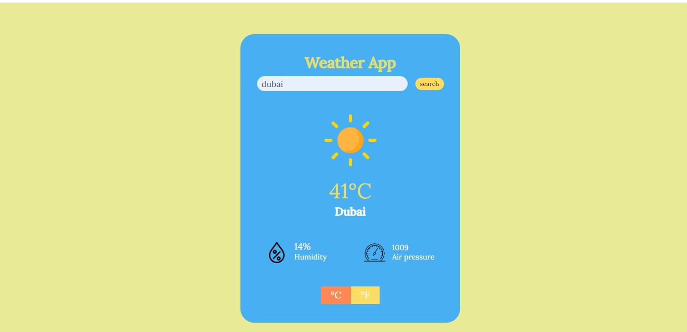

<!--  -->

# Weather-app Built with Javascript

This web application is a basic page created using JavaScript, html and css. Create a weather forecast site using the weather API. This web application enable you to search for a specific location and toggle the data from °C to °F.

## Built With

- JavaScript
- CSS & HTML
- OpenWeather API

### Live Demo link.

[Live Demo](https://gleeful-taiyaki-1b687c.netlify.app/)

## Getting Started

- Clone the repo `https://github.com/Ajiboso-Adeola/Weather-app.git`
- cd into `Weather-app`
- Run `git pull origin development`
- Open the app in your local host server while on the `Weather-app` directory in index.html file.

<!-- ### Run Tests -->

### Screenshot



<!--  -->

## Author

👤 **Adeola Ajiboso**

- Github: [@githubhandle](https://github.com/Ajiboso-Adeola)
- Twitter: [@twitterhandle](https://twitter.com/dde_olla)
- Linkedin: [linkedin](https://www.linkedin.com/in/adeola-ajiboso/)

## 🤝 Contributing

Contributions, issues and feature requests are always welcome!

I love meeting other developers, especially ones that give me advice on how to improve my work.

### How to Contribute

To get a local copy up and running follow these simple example steps.

```
- Fork the repository
- git clone https://github.com/your_username/Weather-app
- git checkout development
- git checkout -b branch name
- git remote add upstream https://github.com/Ajiboso-Adeola/Weather-app
- git pull upstream development
- git commit -m "commit message"
- git push -u origin HEAD
```

## Show your support🙏

Don't forget to give this repo a ⭐️.
